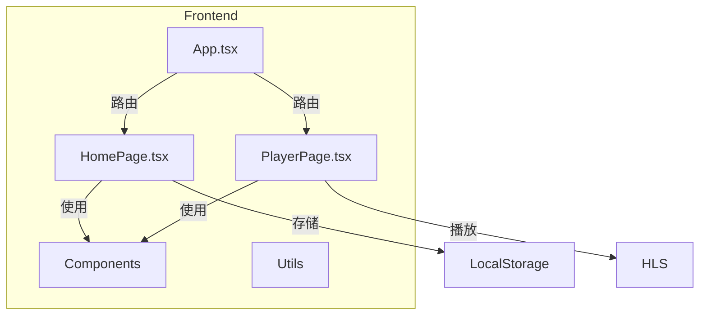

## 1. Architecture Design
纯前端应用，使用React组件化架构，无后端依赖。



## 2. Technology Description
- Frontend: React@18 + TypeScript + Tailwind CSS + Vite
- 路由: React Router DOM
- 视频播放: HLS.js
- 初始化工具: vite-init

## 3. Route Definitions
| Route | Purpose |
|-------|---------|
| / | 首页，M3U8链接输入 |
| /player | 播放页，视频播放 |

## 4. API Definitions (if backend exists)
无后端API

## 5. Server Architecture Diagram (if backend exists)
无后端

## 6. Data Model (if applicable)
### 6.1 历史记录存储 (LocalStorage)
```typescript
interface HistoryItem {
  url: string;
  timestamp: number;
}
```

### 6.2 数据存储
使用 localStorage 存储播放历史，键名为 `m3u8_player_history`
