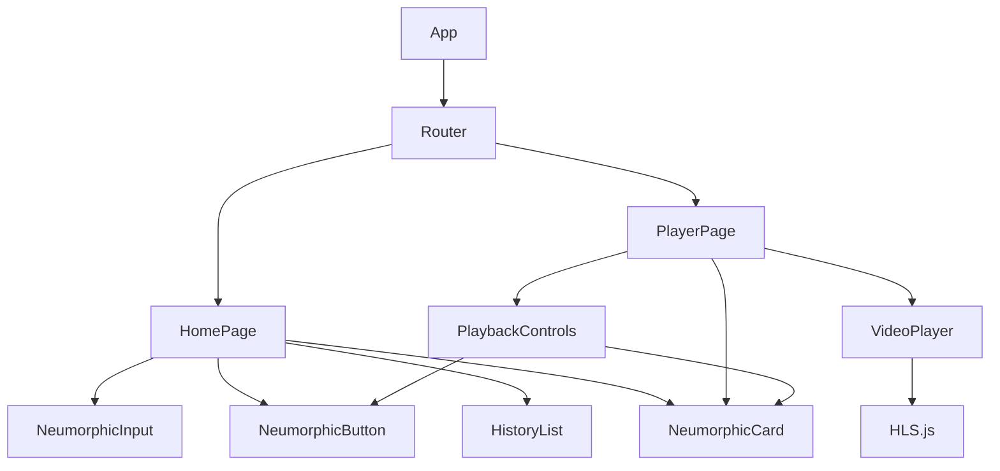

## 1. Architecture Design


## 2. Technology Description
- 前端：React@18 + TypeScript + Tailwind CSS@3 + Vite
- 初始化工具：vite-init
- 路由：React Router
- 视频播放：hls.js
- 状态管理：React Hooks + localStorage
- 后端：无（纯前端项目）

## 3. Route Definitions
| Route | Purpose |
|-------|---------|
| / | 首页 - M3U8链接输入和历史记录 |
| /player | 播放页 - 视频播放和控制 |

## 4. Component Structure
```
src/
├── components/
│   ├── NeumorphicInput.tsx    # 新拟态输入框
│   ├── NeumorphicButton.tsx   # 新拟态按钮
│   ├── NeumorphicCard.tsx     # 新拟态卡片
│   ├── VideoPlayer.tsx        # 视频播放器核心
│   ├── PlaybackControls.tsx   # 播放控制栏
│   └── HistoryList.tsx        # 历史记录列表
├── pages/
│   ├── HomePage.tsx           # 首页
│   └── PlayerPage.tsx         # 播放页
├── App.tsx                    # 主应用和路由
├── main.tsx                   # 入口文件
└── index.css                  # 全局样式
```

## 5. Key Implementation Details

### 5.1 HLS播放策略
```typescript
// 检测浏览器原生支持
if (videoRef.current?.canPlayType('application/vnd.apple.mpegurl')) {
  videoRef.current.src = url;
} else if (Hls.isSupported()) {
  const hls = new Hls();
  hls.loadSource(url);
  hls.attachMedia(videoRef.current);
}
```

### 5.2 新拟态样式
```css
/* 凸起效果 */
.neumorphic-convex {
  box-shadow: 5px 5px 15px #c4c9d0, -5px -5px 15px #ffffff;
}

/* 凹陷效果 */
.neumorphic-concave {
  box-shadow: inset 3px 3px 8px #c4c9d0, inset -3px -3px 8px #ffffff;
}
```

### 5.3 横竖屏适配
- 使用CSS媒体查询 `@media (orientation: landscape/portrait)`
- 使用 `window.matchMedia` 监听屏幕方向变化
- 使用Fullscreen API处理全屏

### 5.4 历史记录存储
- 存储在 `localStorage` 中，key: `m3u8-history`
- 最多保存10条记录，新记录添加到前面
