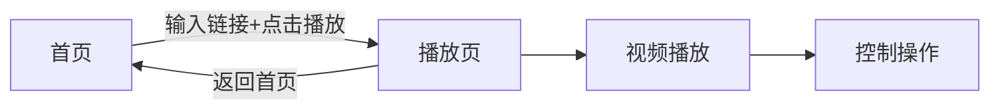

## 1. Product Overview
一款现代化的移动端H5 M3U8在线播放器，融合扁平化与新拟态(Neumorphism)风格，支持视频播放、历史记录、横竖屏切换和全屏播放。
- 解决用户在移动端快速播放M3U8视频流的需求，提供优雅的UI体验
- 目标用户为需要在手机上播放网络视频流的用户，市场价值在于简洁易用的设计和流畅的播放体验

## 2. Core Features

### 2.2 Feature Module
1. **首页**：M3U8链接输入、播放按钮、历史记录展示
2. **播放页**：视频播放器、播放控制、信息展示

### 2.3 Page Details
| Page Name | Module Name | Feature description |
|-----------|-------------|---------------------|
| 首页 | 输入区 | 新拟态输入框，支持粘贴M3U8链接 |
| 首页 | 播放按钮 | 新拟态凸起按钮，点击跳转到播放页 |
| 首页 | 历史记录 | 展示最近播放链接，存储在localStorage |
| 播放页 | 视频播放器 | 支持HLS流播放，兼容主流浏览器 |
| 播放页 | 控制栏 | 播放/暂停、进度条、时间显示、全屏 |
| 播放页 | 横竖屏适配 | 自动检测屏幕方向，调整布局 |

## 3. Core Process
用户在首页输入M3U8链接，点击播放按钮跳转到播放页，播放页加载并播放视频，用户可通过控制栏操作视频，支持横竖屏和全屏切换。

## 4. User Interface Design
### 4.1 Design Style
- 主色调：蓝紫色渐变 (#7c6ff7 到 #6c63ff)
- 背景色：浅灰色 #e8ecf1
- 按钮风格：新拟态(Neumorphism)设计，凸起/凹陷效果
- 字体：系统默认无衬线字体，保持现代简洁感
- 布局风格：卡片式布局，柔和阴影
- 图标：简洁的SVG线条图标

### 4.2 Page Design Overview
| Page Name | Module Name | UI Elements |
|-----------|-------------|-------------|
| 首页 | 顶部标题 | 居中文字，微妙字间距 |
| 首页 | 输入区 | 凹陷新拟态输入框，圆角16px |
| 首页 | 播放按钮 | 凸起新拟态按钮，蓝紫色渐变，按压凹陷动画 |
| 首页 | 历史记录 | 凸起新拟态卡片列表 |
| 播放页 | 返回按钮 | 圆形凸起新拟态按钮 |
| 播放页 | 播放器 | 黑色背景，视频填充 |
| 播放页 | 信息区 | 凸起新拟态卡片，显示链接和状态 |
| 播放页 | 控制栏 | 半透明覆盖，新拟态进度条 |

### 4.3 Responsiveness
- 移动端优先设计，适配375-428px宽度
- 使用orientation媒体查询和matchMedia监听横竖屏切换
- 竖屏：播放器占上半部分，信息在下方
- 横屏/全屏：播放器全屏，信息区隐藏

### 4.4 动画与交互
- 所有交互使用200-300ms的过渡动画
- 按钮按压有凹陷反馈
- 进度条滑块有新拟态效果
- 页面切换有平滑过渡
