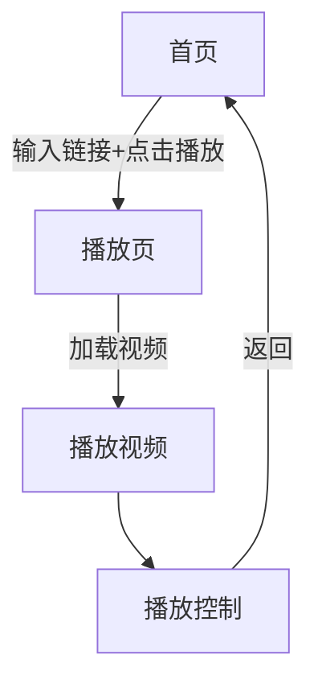

## 1. Product Overview
一款现代化的手机端M3U8在线播放器，融合扁平化与新拟态(Neumorphism)设计风格，支持HLS流媒体播放，提供流畅的移动端播放体验。
- 解决移动设备上播放M3U8视频流的需求，支持历史记录、横竖屏适配、全屏播放等功能
- 目标用户为需要在手机上在线观看M3U8格式视频内容的移动用户

## 2. Core Features

### 2.1 User Roles (if applicable)
无需用户角色区分，所有功能对访客开放

### 2.2 Feature Module
1. **首页**: M3U8链接输入、播放按钮、历史记录展示
2. **播放页**: 视频播放、播放控制、横竖屏适配、全屏播放

### 2.3 Page Details
| Page Name | Module Name | Feature description |
|-----------|-------------|---------------------|
| 首页 | 链接输入区 | 新拟态风格输入框，支持输入M3U8播放链接 |
| 首页 | 播放按钮 | 新拟态凸起按钮，点击跳转到播放页 |
| 首页 | 历史记录 | 展示最近播放的链接，点击快速播放 |
| 播放页 | 视频播放器 | 支持HLS播放，处理加载和错误状态 |
| 播放页 | 播放控制栏 | 播放/暂停、进度条、时间显示、全屏按钮 |
| 播放页 | 横竖屏适配 | 自动检测屏幕方向，适配布局 |

## 3. Core Process
用户在首页输入M3U8链接 → 点击播放按钮 → 跳转到播放页 → 视频加载并播放 → 用户可使用控制栏操作 → 支持横竖屏切换和全屏播放

## 4. User Interface Design
### 4.1 Design Style
- 背景色: #e8ecf1 (浅灰蓝)
- 新拟态凸起阴影: 5px 5px 15px #c4c9d0, -5px -5px 15px #ffffff
- 新拟态凹陷阴影: inset 3px 3px 8px #c4c9d0, inset -3px -3px 8px #ffffff
- 主色调: 蓝紫色系 (#7c6ff7, #6c63ff)
- 圆角: 12-16px
- 字体: 系统默认无衬线字体
- 交互: 200-300ms过渡动画，按压反馈

### 4.2 Page Design Overview
| Page Name | Module Name | UI Elements |
|-----------|-------------|-------------|
| 首页 | 整体布局 | 新拟态风格，浅灰背景，居中布局 |
| 首页 | 标题区 | 现代字体，微妙字间距 |
| 首页 | 输入区 | 凹陷输入框(16px圆角)，内阴影 |
| 首页 | 按钮 | 凸起按钮，蓝紫色渐变，按压动画 |
| 首页 | 历史记录 | 凸起卡片列表 |
| 播放页 | 播放器 | 黑色背景，占屏幕上半部分(竖屏) |
| 播放页 | 控制栏 | 半透明覆盖，SVG线条图标 |

### 4.3 Responsiveness
- 移动端优先，适配375-428px宽度
- 横竖屏媒体查询适配
- 触控区域最小44x44px
- 兼容iPhone Safari和安卓Chrome

### 4.4 3D Scene Guidance (if applicable)
不适用3D场景
